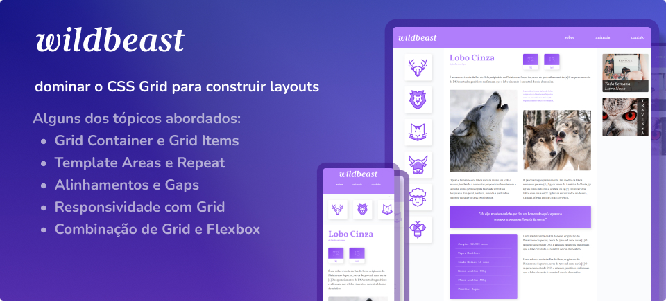
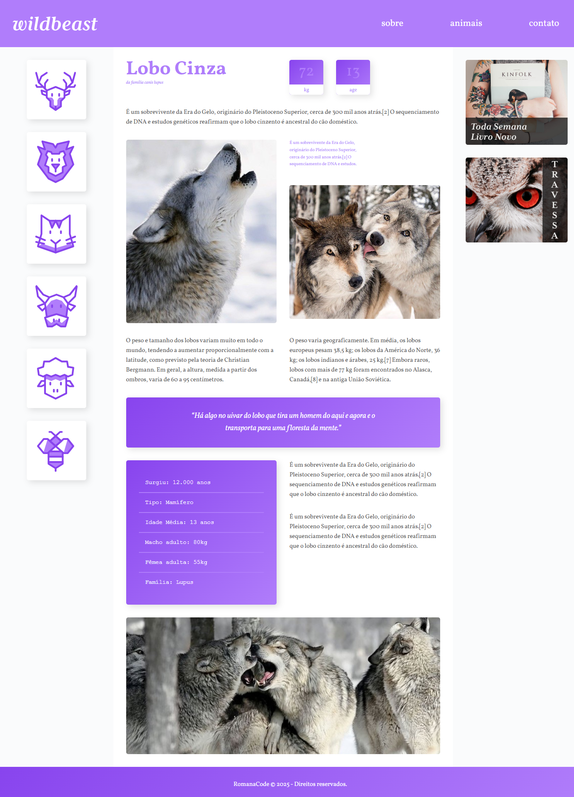

# Projeto Wildbeast 🐺

Este projeto foi desenvolvido durante o curso [CSS Grid
Layout](https://www.origamid.com/curso/css-grid-layout) da Origamid.\
O curso aborda em profundidade os conceitos de **CSS Grid**, explorando
desde a base até técnicas avançadas de layout responsivo.

## 🎯 Objetivo do Curso

O objetivo principal foi dominar o **CSS Grid** para construir layouts
modernos, flexíveis e responsivos, sem depender exclusivamente de
frameworks.

## 📚 Conteúdo do Curso

Alguns dos tópicos abordados: - Introdução ao CSS Grid - Grid Container
e Grid Items - Template Areas e Repeat - Alinhamentos e Gaps -
Responsividade com Grid - Combinação de Grid e Flexbox

## 🚀 Meu Projeto

No projeto final, recriei e personalizei o site **Wildbeast**, aplicando
técnicas aprendidas no curso.

### Principais Customizações Feitas:

- Adicionei efeitos de **hover** com `transform: scale()` em imagens e
  elementos interativos.
- Estilizei a navegação lateral com **animações sutis** para melhorar
  a experiência do usuário.
- Trabalhei com **media queries** para garantir a responsividade em
  telas pequenas.
- Ajustei cores, sombras e transições para dar mais destaque ao
  layout.
- Incluí efeitos de **zoom** e transições suaves em imagens
  (`.zoom-effect`, `.elev`).

## 🖼️ Estrutura do Projeto

- **index.html** → Estrutura HTML baseada no CSS Grid.
- **style.css** → Estilização personalizada com Grid, Flexbox e
  animações.

## 👨‍💻 Autor

Projeto desenvolvido por **Emerson Romana** durante os estudos de **CSS
Grid Layout**.

📅 05/09/2025
